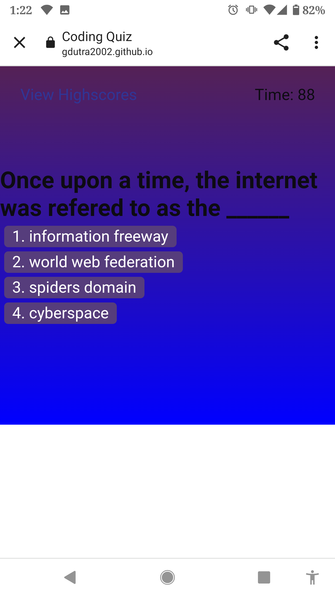

# Codeassessment

## Description

This webpage simulates a basic javascript knowledge assessment.  The format will be a game like timed quiz that presents questions to the user.  Incorrect responses will subtract time from the clock.  The game is over when the user answers all questions or the timer reaches 0 seconds. The users initials and score will be locally saved.

## Installation

 https://gdutra2002.github.io/Codeassessment/

## Usage

## Credits

https://github.com/gdutra2002

To create this game app, I built upon previously distribute code from the UCD bootcamp module.  Additionally, the MDN and various functionality for CSS, JS, HTML were googled.
Majority credit to the UCD tutors, modules, the internet, specifically the main module04 code, as modifying a native quiz app from scratch is my current level.

https://ucdavis.bootcampcontent.com/ucdavis-boot-camp/UCD-VIRT-FSF-PT-12-2022-U-LOLC/-/tree/main/04-Web-APIs
1c11657ccbf614c0331bbd2e3d1cd141c9e0f6aa

https://developer.mozilla.org/en-US/docs/Web/HTML/Element/li

## License

MIT

## Badges

## How to Contribute

If you created an application or package and would like other developers to contribute to it, you can include guidelines for how to do so. The [Contributor Covenant](https://www.contributor-covenant.org/) is an industry standard, but you can always write your own if you'd prefer.

https://linkedin.com/in/gary-e-dutra-15357940

## Tests

Go the extra mile and write test questioins along to help others asses their development skills. Then submit questions to the author with answers, or to improve the code functionality to provide better examples on how to run them here.

This!!!